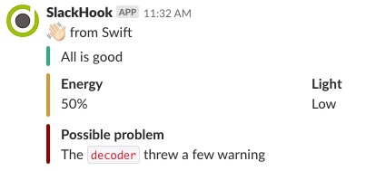

# SlackHook [](https://gitlab.com/optimisedlabs/slackhook/commits/master)

[](https://gitlab.com/optimisedlabs/slackhook/commits/master)
[](https://codebeat.co/projects/github-com-optimisedlabs-slackhook-master)
[](https://developer.apple.com/swift/)
[](https://gitlab.com/optimisedlabs/slackhook)
[](https://swift.org/package-manager)
[](LICENSE)

Send messages to Slack from Swift.

## Features

- [x] Send simple text only messages
- [x] Add attachements with colours and fields
- [x] Fully tested

See [Slack API documentation](https://api.slack.com/docs/messages) for more information.

## Demo

To get a feel for what is possible with SlackHook you can run the built-in demo:

```
swift build
swift run SlackHook <WebHook URL>
```

Replace `<WebHook URL>` with the a valid Slack WebHook URL and you will see a demo message posted similar to the following:



## Usage

SlackHook should be simple to use and have a self explanatory API.

```swift
import SlackHookCore

let slackHook = try SlackHook(from: "<WebHook URL>")
let message = Message(text: "Hello from Swift", username: "SlackHook", attachments: nil)
try! slackHook.post(message)
```

*NOTE*: Assuming you have a runloop, otherwise `RunLoop.main.run()` will be needed. See [Sources/SlackHook/main.swift](Sources/SlackHook/main.swift) for how this is used in the command line tool.

## Dependancies

- [Foundation](https://developer.apple.com/documentation/foundation/urlsession)
- [SimpleRESTLayer](https://github.com/graemer957/SimpleRESTLayer)

## Requirements

- Swift 4.1+ / Xcode 9.4.1+
- iOS 10.0+ / macOS 10.12+ / tvOS 10.0+ / watchOS 3.0+
- Ubuntu 14.04 / Ubuntu 16.04 / Ubuntu 16.10

## Installation

### Swift Package Manager

In your `Packages.swift` add:

```swift
.package(url: "https://gitlab.com/optimisedlabs/slackhook.git", .from: "0.3.0")
```

*NOTE*: `.upToNextMinor(from: "0.3.0")` might be better whilst the API stablises.

## Acknowledgements and thanks

Whilst this is by no means an exhaustive list, I would like to thank:
- [Apple](https://developer.apple.com), standing on the shoulders of giants...
- Excellent article on [Building a command line tool using the Swift Package Manager](https://www.swiftbysundell.com/posts/building-a-command-line-tool-using-the-swift-package-manager) by [John Sundell](https://github.com/johnsundell)
- [httpbin](https://httpbin.org), a simple HTTP Request & Response Service. Such a useful tool, cannot recommend enough.
- [Using XCTAssertThrowsError in your Swift tests](http://makebeforebreak.com/post/using-xctassertthrowserror-in-your-swift-tests/) for testing the right `Error` is thrown

## License

SlackHook is released under the Apache 2.0 license. See [LICENSE](LICENSE) for details.
